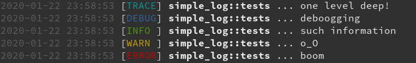
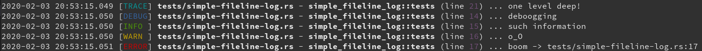

# loge

[](https://crates.io/crates/loge)
[](https://docs.rs/loge)
[](https://crates.io/crates/loge)
[](https://github.com/PsiACE/loge/actions)

> It helps to be diligent in recording and willing to review.

A simple logger with formatted output for easy analysis. Free your productivity start with best practices logs.

`loge` is currently controlled by features and environment variables:

- If you need to record time, enable `chrono`;
- When you enable `json`, you also need to enable `chrono`;
- For pretty output, enable `colored`.
- By default, we turn on all three features.
- You can choose one of three formats: `target`, `fileline` or `json`. (Set environment variable `LOGE_FORMAT`.)

_**Examples**_:

- *target*: `date time [level] target ... message`:

    

- *fileline*: `date time [level] file -  (line) ... message`:

    

- *json*:

    ```JSON
    {
    "time": "2020-02-02 18:33:33.645",
    "level": "ERROR",
    "message": "boom -> tests/simple-jsonified-log.rs:17",
    "service": {
        "name": "loge",
        "version": "0.3.1"
    },
    "location": {
        "file": "tests/simple-jsonified-log.rs",
        "line": 17,
        "target": "simple_jsonified_log::tests"
    }
    }
    ```

## TODO

- [ ] Format
  - [x] Simple JSON Logger. // Unoptimized.
  - [x] Colorful, Intuitive.
- [ ] Analysis
  - [ ] Basic Parser.
  - [ ] Coarse-grained Chart.
- [ ] Others
  - [x] Lightweight - As few dependencies as possible.
  - [ ] More flexible and reliable configuration.

## Usage

At first, you should add it to your `Cargo.toml` file.

```toml
[dependencies]
log = "0.4.8"
loge = "0.4.0"
```

After that, set the `RUST_LOG` variable in your code and initialize the logger.

```rust
env::set_var("RUST_LOG", "trace");
env::set_var("LOGE_FORMAT", "target"); // `fileline` or `json`(need enable `json` and `chrono`)
loge::init();
```

Just run your project, you will get logs in the terminal.

## Contact

Chojan Shang - [@PsiACE](https://github.com/psiace) - <psiace@outlook.com>

Project Link: [https://github.com/psiace/loge](https://github.com/psiace/loge)

## License

Licensed under either of:

- Apache License, Version 2.0 ([LICENSE-APACHE](./LICENSE-APACHE) or [http://apache.org/licenses/LICENSE-2.0](http://apache.org/licenses/LICENSE-2.0))
- MIT license ([LICENSE-MIT](./LICENSE-MIT) or [http://opensource.org/licenses/MIT](http://opensource.org/licenses/MIT))

## Acknowledge

- Thank you [Sean McArthur](https://seanmonstar.com) for [`pretty_env_log`](https://github.com/seanmonstar/pretty-env-logger).
- Thank you [Sam Clements](https://mastodon.social/@borntyping) for [`rust-simple_logger`](https://github.com/borntyping/rust-simple_logger).
